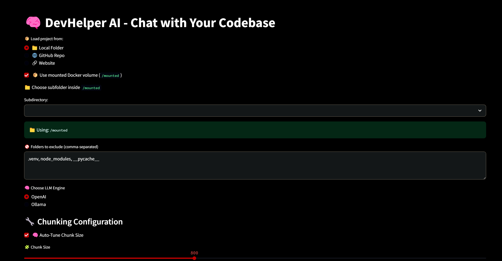

# 🧠 DevHelper AI

Chat with your codebase. Analyze local projects, GitHub repos, or entire websites using OpenAI or Ollama.

🌐 **Live Demo:** [https://devhelper-ai.onrender.com](https://devhelper-ai.onrender.com)

---

## 🚀 Features

- 🔍 RAG + Chunking + Vector Search
- 📂 Local folders or mounted Docker volumes
- 🌐 GitHub & Website support
- 🧠 Ollama (LLaMA3) and OpenAI support
- 🧱 ChromaDB persistence
- 💬 Streamlit-based UI
- 📥 Export chat history

---

## ⚙️ Local Setup

```bash
git clone https://github.com/XessX/devhelper-ai
cd devhelper-ai
cp .env.example .env
Add your OPENAI_API_KEY in .env.

▶️ Run the App
bash

pip install -r requirements.txt
streamlit run app.py

🐳 Docker Mode (Recommended)
powershell
.\run-devhelper.ps1
Your local project folder will be mounted to /mounted.

☁️ Deploy to Render
Push to GitHub: https://github.com/XessX/devhelper-ai

One-click deploy using render.yaml

Set your Render env variable:
env
OPENAI_API_KEY=your-key-here


## 📸 Screenshot




💡 Use Cases
Chat with unfamiliar repositories

Understand legacy codebases

Explore GitHub projects interactively

Extract README or architecture details

Scrape and summarize documentation sites

📁 Project Structure
bash
Copy
Edit
devhelper-ai/
├── app.py                  # Streamlit frontend
├── rag_engine/             # Code loaders, chunkers, RAG logic
│   ├── chunker.py
│   ├── loader.py
│   ├── query_engine.py
│   ├── utils.py
│   └── vector_store.py
├── Dockerfile              # Docker container
├── run-devhelper.ps1       # Powershell launcher
├── requirements.txt        # Python dependencies
├── .env.example            # Environment variable sample
├── render.yaml             # Render deploy spec
└── README.md               # You're reading it!


👨‍💻 Author
DevHelper AI by [Al_Jubair_Hossain]

🙌 Acknowledgments
LangChain

Ollama

ChromaDB

Streamlit

📡 Connect
📬 Al Jubair Hossain
📎 GitHub: [@XessX](https://github.com/XessX)
📎 LinkedIn: [al-jubair-hossain](https://linkedin.com/in/al-jubair-hossain-2ab89011b/)